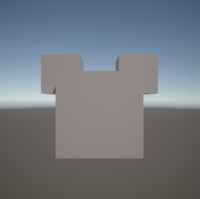
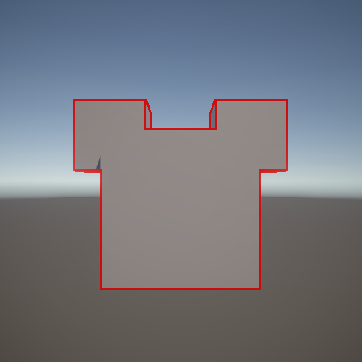
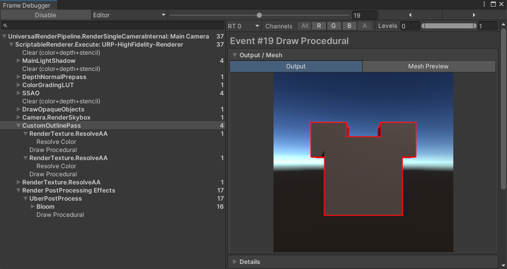

# Unity 渲染学习报告：URP 与 HDRP 的对比分析及自定义管线实践

该项目为个人学习，围绕 Unity 可编程渲染管线（SRP）展开，对比了 URP 与 HDRP 的技术架构，并完成了一套自定义 Render Feature 与后处理管线的[工程实现](./UnityProject/)。

## 一、 渲染管线概述

### 1.1 传统内置管线的局限性
传统内置管线（Built-in Render Pipeline）属于黑盒架构设计。这种高度封装导致其渲染流水线（如剔除、光照遍历、排序、DrawCall 提交）缺乏细粒度的调整途径。在应对现代游戏复杂多变的渲染需求时，往往需要通过繁琐的 CommandBuffer 注入或 Multi-Pass 绕过底层限制，这不仅会导致严重的性能损耗，也难以充分利用有限资源开发更精美的画面。

### 1.2 SRP 的引入及其核心优势
Unity 可编程渲染管线（Scriptable Render Pipeline, SRP）本质上是对渲染控制流的解耦。引擎底层（C++ 层）保留了剔除和渲染 API 调用的核心计算，而将高层的渲染逻辑组织（如 Render Pass 的拓扑依赖、渲染目标的分配）暴露给 C# 层。配合 Unity 的 C# Job System 与 Burst Compiler，SRP 使得开发者能够以极低的主线程开销构建渲染流，为针对不同硬件架构定制渲染策略提供了底层基石。

## 二、 URP 与 HDRP 技术原理对比

|  | URP (Universal Render Pipeline) | HDRP (High Definition Render Pipeline) |
| :--- | :--- | :--- |
| **设计核心** | 面向移动设备与多平台，极致功耗，带宽控制 | 面向高性能计算单元，依赖 Compute Shader 驱动 |
| **目标平台** | 移动端（iOS/Android/鸿蒙）、Switch、低配 PC、VR 一体机等 | 高配 PC、PS5/Xbox Series X 等 |
| **渲染逻辑** | 单 Pass 前向渲染（Forward）、基于Tile的延迟渲染（Tile-Based Deferred） | 延迟渲染（Deferred）、分块前向渲染（Forward+）、Clustered 光照剔除 |
| **光照** | 精简版 PBR 模型，限制光源数量 | 高级 PBR 模型，物理光照系统，支持实时光线追踪、体积光、次表面散射 |
| **后处理** | 整合所有后期 Pass，一次全屏 Blit 完成，低带宽消耗 | 基于物理的相机参数，高精度的物理级后期滤镜 |
| **定制拓展** | 依靠 Render Feature 扩展定制 | 通过 Custom Pass 注入自定义 Compute/Shader 逻辑 |
| **适用场景** | 移动端游戏、跨平台独立游戏 | 3A 级 PC/主机游戏、影视动画、建筑/工业可视化 |

## 三、 渲染架构设计与性能优化
性能优化是引擎开发的核心命题。本章节首先探讨 URP 的常规优化手段，再结合过往Unity引擎底层开发经验，深入剖析基于软光栅遮挡剔除的性能优化方案。

### 3.1 CPU 提交优化
在实时渲染管线中，CPU 侧的性能瓶颈不仅来自多边形的提交次数，还源于频繁的渲染状态切换。针对该性能瓶颈，Unity 引擎的渲染优化策略经过了多代演进。

#### 3.1.1 传统合批策略
传统优化方案的核心思路是减少 Draw Call 的次数，主要包括静态批处理（Static Batching）与动态批处理（Dynamic Batching）。 
 
* **静态批处理**：该策略采用“空间换时间”的机制，将共享相同材质实例的静态网格合并为统一的顶点缓冲对象。尽管该方法可有效减少 Draw Call，但因同源模型的顶点数据被多次复用存储，会导致显著的内存占用增加。  

* **动态批处理**：该策略依赖 CPU 侧的计算资源，每帧对模型顶点进行世界空间的矩阵变换并在合并后提交。由于存在较高的 CPU 计算开销，当前高精度模型广泛应用的背景下，动态批处理的适用性不足。

#### 3.1.2 GPU Instancing
针对传统合批机制的局限性，GPU Instancing 提供了基于硬件的优化途径，其核心机制为单次提交、多次绘制。对于共享相同网格与材质的渲染对象，CPU 仅需发起一次 Draw Call，并通过独立的缓冲区传递各实例的差异化数据，如 Transform、Color 或 MaterialPropertyBlock。在实际工程中，GPU Instancing 主要应用于植被渲染或大批量同质化特效。但该方案无法处理网格或材质实例存在差异的渲染对象，普适性不足。

#### 3.1.3 SRP Batcher
面对复杂场景中具备不同网格与材质参数的渲染对象，传统方案存在明显不足。SRP Batcher 作为 URP 管线下的核心优化机制，将传统的“基于材质合批”转换为“基于着色器变体合批”。其底层设计通过将低频修改的材质数据（如 Color、Texture）与高频修改的物体数据（如 Transform）进行物理隔离来实现优化。  

URP 将材质属性封装于 `UnityPerMaterial` 常量缓冲区中，仅当材质参数变更时触发按需更新并驻留显存；同时，物体的变换矩阵等实例级数据被独立存储于 `UnityPerDraw` 缓冲区中。当 URP 连续渲染使用相同着色器变体但材质参数不同的对象时，CPU 无需重新绑定着色器或传输材质数据，仅需通过轻量级指令修改常量缓冲区的内存偏移量即可完成状态更新，从而大幅降低了 SetPass Call 的 CPU 开销。

### 3.2 GPU 带宽治理与流式加载架构
对于移动端 URP 渲染架构，主要面临的两大核心性能瓶颈分别是：GPU 的带宽开销与场景切换时的内存/IO 峰值。为了提升性能，应从管线后处理与资源调度两个维度进行优化。

#### 3.2.1 移动端 GPU 带宽治理与后处理优化
移动端 GPU 的核心痛点在于系统内存（System Memory）与 Tile 内存（On-Chip Memory）之间的数据搬迁开销。URP 的 Volume 后处理系统采取了以下策略：  

* **Uber Shader 架构合并**： 将 Bloom、Color Grading、Vignette 等多个独立的后处理运算合并为一个全局 Uber Shader。该策略确保了在单次 Pass 内完成计算，仅产生一次全屏的读写操作，避免了 RenderTarget 的频繁切换带来的开销。
  
* **下采样与上采样**： 针对 Bloom 等需要多次 Blit 操作的高斯模糊效果，若强行在全尺寸 RenderTarget 上操作，会导致带宽过高。在Prefilter阶段，将画面降采样至原分辨率的 1/4，随后在低分辨率纹理上完成下采样与上采样，最后利用双线性插值进行叠加。该策略使带宽开销指数级下降，缓解了 GPU 的性能开销。

#### 3.2.2 资源内存管理与流式加载
除了渲染管线内的带宽问题，大量美术资产的同时加载往往是导致运行时卡顿的根源。为此，需要与 URP 架构配合构建一套流式加载系统。该系统抛弃传统的整体网格同步加载模式，将场景网格切分为更细粒度的簇。基于玩家摄像机的位置与视锥体朝向，在后台线程进行异步的网格加载与卸载。

另外，进一步通过纹理流式加载机制，优先保证屏幕内核心物体的 Mipmap 层级，对远景或非重要资产的纹理进行动态降级，从而在保证画面表现的同时，将系统内存占用限制在预算之内。

### 3.3 基于 SDOC 软光栅的遮挡剔除系统
传统的视锥体剔除面对某些复杂场景时，依然会放行被前方大型掩体遮挡的物体，导致 GPU 产生严重的 Overdraw。为了解决这一问题，在实习期间深入探究并集成了一套基于 SDOC 的软光栅遮挡剔除系统。  

该方案抛弃了在移动端上延迟较高的 GPU 硬件遮挡查询，利用 CPU 软光栅管线实现了高性能的遮挡剔除。其核心技术栈与架构优势如下。

#### 3.3.1 异步双缓冲架构与帧复用
为了保证剔除计算本身不成为主线程的算力负担，系统在顶层调度上采用了异步解耦架构。整个剔除计算（包含遮挡物的光栅化与被遮挡物的深度查询）被封装在独立的 C# Job 中提交至 Worker 线程执行。主线程直接复用上一帧的可见性判定结果，不会对 CPU 主线程产生阻塞。

另外，系统每帧会计算当前相机矩阵与上一帧矩阵的偏差。若检测到场景处于静止或微小移动，则触发帧复用逻辑，直接复用上一帧的深度图。此策略在静态观察时可将当帧的遮挡剔除成本降至接近于零。

#### 3.3.2 低成本软光栅渲染
软光栅器是剔除引擎的核心，其本质是通过极简指令榨干 CPU 吞吐量。在进行 MVP 矩阵变换、视锥裁剪与背面剔除时，单条 SIMD 指令即可并行完成 8 个图元的几何运算。为了降低光栅化的计算量，该系统设计了预计算覆盖表。因此在光栅化填充阶段，该系统抛弃了昂贵的逐像素边缘函数的代数计算，而用离线预计算的查找表代替。运行时仅需根据图元边缘的斜率与偏移量直接查表，即可获取该图元的覆盖掩码，通过位操作直接完成8×8像素块的覆盖状态填充。

#### 3.3.3 智能调度与 Hi-Z
在生成深度图前，系统根据遮挡物在屏幕空间的投影面积与距相机的深度动态计算权重，动态截取前 k 个高权重遮挡物（如城墙、地面、大体量建筑），确保遮挡物的有效性和数量限制。  

被遮挡物仅需提交 AABB 包围盒。将其投影至屏幕空间后，与构建好的Hi-Z Buffer中对应 Mip 级别的最大深度进行比对。只要包围盒最小深度深于Buffer的最大深度，即可判定为完全遮挡，直接从 DrawCall 队列中抹除。  

此外，根据上一帧的剔除率与 CPU/GPU 耗时占比，系统动态在预设的不同等级深度图分辨率中切换，实现软光栅本身的动态负载均衡。

## 四、 自定义 Render Feature 与后处理实践
为了深入验证 URP 管线的数据控制流并掌握其扩展机制，本项目在 URP 架构下完成了一套基于深度法线纹理的屏幕空间描边后处理。该方案摒弃了传统的“法线外扩”多次绘制策略，采用全屏后处理方案，以极低的 DrawCall 开销实现硬表面物体的精准轮廓提取。
### 4.1 管线拓展架构与生命周期
该特性的实现依托于 URP 的两个核心基类：  

`ScriptableRendererFeature`：作为管线的注册入口，负责实例化 RenderPass，并声明该后处理需要管线提前生成深度图与法线图。  

`ScriptableRenderPass`：作为实际的执行载体，负责通过 CommandBuffer 派发渲染指令，并管控 RenderTarget 的内存分配与释放。
### 4.2 核心代码实现
在 `CustomOutlineFeature` 类中，主要实现后处理资源的初始化、数据依赖声明与管线注入。首先在 `Create` 阶段完成 Pass 实例的构建；在 `AddRenderPasses` 阶段，通过 ConfigureInput 显式声明对深度与法线附件的依赖，阻止 Tile-Based 架构的移动端对这些缓冲的默认 Discard 优化；最后在 `SetupRenderPasses` 阶段截获当前相机的 Color Target 句柄，将其作为后续全屏特效的输入输出基准。

```csharp
public class CustomOutlineFeature : ScriptableRendererFeature
{
    [System.Serializable]
    public class OutlineSettings
    {
        public Material outlineMaterial = null;
        public RenderPassEvent renderPassEvent = RenderPassEvent.AfterRenderingSkybox;
    }

    public OutlineSettings settings = new OutlineSettings();
    private CustomOutlinePass m_OutlinePass;

    public override void Create()
    {
        if (settings.outlineMaterial == null) return;

        m_OutlinePass = new CustomOutlinePass(settings.outlineMaterial)
        {
            renderPassEvent = settings.renderPassEvent
        };
    }

    public override void AddRenderPasses(ScriptableRenderer renderer, ref RenderingData renderingData)
    {
        if (settings.outlineMaterial == null)
        {
            Debug.LogWarning("描边材质未赋值！");
            return;
        }

        // 显式请求 Depth 和 Normal，防止移动端将其 Discard
        m_OutlinePass.ConfigureInput(ScriptableRenderPassInput.Depth | ScriptableRenderPassInput.Normal);

        // 注入管线
        renderer.EnqueuePass(m_OutlinePass);
    }

    public override void SetupRenderPasses(ScriptableRenderer renderer, in RenderingData renderingData)
    {
        if (m_OutlinePass != null)
        {
            // 为 Pass 设置当前相机的 Color Target
            m_OutlinePass.Setup(renderer.cameraColorTargetHandle);
        }
    }
}
```
  
  
 
在  `CustomOutlinePass ` 类中，主要实现渲染目标的内存管控与后处理指令的调度派发。利用 `RTHandle` 与 `ReAllocateIfNeeded` 在 `OnCameraSetup` 阶段按需动态申请一张无深度的临时颜色缓冲，并在生命周期末端释放以规避显存泄漏。`Execute` 方法则通过向 `CommandBuffer` 压入指令，利用 Blitter API 完成了“原画面 -> 临时RT（执行 Shader 卷积运算） -> 原画面”的 Ping-Pong 渲染数据流，最终将整个指令集提交至 GPU 执行。

```csharp
public class CustomOutlinePass : ScriptableRenderPass
{
    private Material m_OutlineMaterial;
    private RTHandle m_CameraColorTarget;
    private RTHandle m_TemporaryColorTexture;

    public CustomOutlinePass(Material mat)
    {
        m_OutlineMaterial = mat;
        // 渲染时机：与天空盒绘制完毕之后
        renderPassEvent = RenderPassEvent.AfterRenderingSkybox;
    }

    public void Setup(RTHandle colorTarget)
    {
        m_CameraColorTarget = colorTarget;
    }

    public override void OnCameraSetup(CommandBuffer cmd, ref RenderingData renderingData)
    {
        // 申请一张全屏的临时 RT
        RenderTextureDescriptor desc = renderingData.cameraData.cameraTargetDescriptor;
        desc.depthBufferBits = 0; // 颜色缓冲无需深度
        RenderingUtils.ReAllocateIfNeeded(ref m_TemporaryColorTexture, desc, FilterMode.Bilinear, TextureWrapMode.Clamp, name: "_TempOutlineTexture");
    }

    public override void Execute(ScriptableRenderContext context, ref RenderingData renderingData)
    {
        if (m_OutlineMaterial == null || m_CameraColorTarget == null) return;

        CommandBuffer cmd = CommandBufferPool.Get("CustomOutlinePass");

        // 执行屏幕空间后处理：原图 -> (Shader 描边运算) -> 临时 RT -> 原图
        Blitter.BlitCameraTexture(cmd, m_CameraColorTarget, m_TemporaryColorTexture, m_OutlineMaterial, 0);
        Blitter.BlitCameraTexture(cmd, m_TemporaryColorTexture, m_CameraColorTarget);

        context.ExecuteCommandBuffer(cmd);
        CommandBufferPool.Release(cmd);
    }

    public void Dispose()
    {
        if (m_TemporaryColorTexture != null)
        {
            m_TemporaryColorTexture.Release();
            m_TemporaryColorTexture = null;
        }
    }
}
```

在绑定的 `m_OutlineMaterial` 材质中，其着色器 `CustomOutline.shader` 的核心逻辑是采样屏幕的 Depth 与 Normal 纹理，并利用 Sobel 算子进行 3×3 的空间卷积。深度差用于提取物体前后的物理遮挡轮廓，而法线差则用于弥补平面折角处的结构轮廓。将两者提取的边缘权重相加，最终与主纹理色彩进行插值混合。

```hlsl
Shader "Hidden/Custom/DepthNormalsOutline"
{
    Properties
    {
        _OutlineColor ("Outline Color", Color) = (0, 0, 0, 1)
        _OutlineThickness ("Outline Thickness", Range(0.5, 5.0)) = 1.0
        _DepthThreshold ("Depth Threshold", Range(0.01, 100.0)) = 1.0
        _NormalThreshold ("Normal Threshold", Range(0.01, 1.0)) = 0.5
    }
    
    SubShader
    {
        Tags { "RenderPipeline" = "UniversalPipeline" }
        Cull Off ZWrite Off ZTest Always

        Pass
        {
            Name "SobelOutline"

            HLSLPROGRAM
            #pragma vertex Vert
            #pragma fragment Frag

            #include "Packages/com.unity.render-pipelines.universal/ShaderLibrary/Core.hlsl"
            #include "Packages/com.unity.render-pipelines.universal/ShaderLibrary/DeclareDepthTexture.hlsl"
            #include "Packages/com.unity.render-pipelines.universal/ShaderLibrary/DeclareNormalsTexture.hlsl"
            #include "Packages/com.unity.render-pipelines.core/Runtime/Utilities/Blit.hlsl"

            CBUFFER_START(UnityPerMaterial)
                float4 _OutlineColor;
                float _OutlineThickness;
                float _DepthThreshold;
                float _NormalThreshold;
            CBUFFER_END

            // 采样深度
            float GetDepth(float2 uv)
            {
                return SampleSceneDepth(uv);
            }

            // 采样法线
            float3 GetNormal(float2 uv)
            {
                return SampleSceneNormals(uv);
            }

            half4 Frag(Varyings input) : SV_Target
            {
                float2 uv = input.texcoord;
                
                // 像素偏移量
                float2 texelSize = _ScreenSize.zw * _OutlineThickness;

                // Sobel 3x3 采样点偏移，使用十字对角采样提高性能
                float2 uv_1 = uv + float2(-1, 1) * texelSize;
                float2 uv_2 = uv + float2(1, 1) * texelSize;
                float2 uv_3 = uv + float2(-1, -1) * texelSize;
                float2 uv_4 = uv + float2(1, -1) * texelSize;

                // 深度边缘检测
                float d0 = GetDepth(uv);
                float d1 = GetDepth(uv_1);
                float d2 = GetDepth(uv_2);
                float d3 = GetDepth(uv_3);
                float d4 = GetDepth(uv_4);

                float ld0 = LinearEyeDepth(d0, _ZBufferParams);
                float ld1 = LinearEyeDepth(d1, _ZBufferParams);
                float ld2 = LinearEyeDepth(d2, _ZBufferParams);
                float ld3 = LinearEyeDepth(d3, _ZBufferParams);
                float ld4 = LinearEyeDepth(d4, _ZBufferParams);

                float depthDiff = abs(ld1 - ld4) + abs(ld2 - ld3);
                // 动态阈值：距离相机越远，阈值越大，防止远处物体出现“脏边”
                float depthEdge = step(_DepthThreshold * ld0, depthDiff);

                // 法线边缘检测
                float3 n1 = GetNormal(uv_1);
                float3 n2 = GetNormal(uv_2);
                float3 n3 = GetNormal(uv_3);
                float3 n4 = GetNormal(uv_4);

                float3 normalDiff = abs(n1 - n4) + abs(n2 - n3);
                float normalEdge = step(_NormalThreshold, normalDiff.x + normalDiff.y + normalDiff.z);

                // 任意一个检测出边缘，即判定为边缘
                float edgeWeight = saturate(depthEdge + normalEdge);

                // _BlitTexture 是 Blitter API 自动绑定的源图像
                half4 sourceColor = SAMPLE_TEXTURE2D(_BlitTexture, sampler_LinearClamp, uv);
                
                // 根据边缘权重插值原图与描边颜色
                return lerp(sourceColor, _OutlineColor, edgeWeight);
            }
            ENDHLSL
        }
    }
}
```

### 4.3 效果展示与抓帧分析
#### 4.3.1 效果对比

| 开启前（Default URP） | 开启后（Depth-Normals Edge Outline） |
| :---: | :---: |
|  |  |
| *默认 URP 渲染画面* | *叠加深度法线描边后的画面* |

#### 4.3.2 Frame Debugger 渲染分析

利用 Frame Debugger 抓取单帧渲染树，可以清晰观察到 URP 管线注入的变化：

* **DrawOpaqueObjects**：管线正常绘制不透明物体，并将输出同时写入 `Color Buffer` 以及 `DepthNormals Buffer`。
* **DrawSkybox**：绘制天空盒环境。
* **CustomOutlinePass**：注入的 Pass 介入。管线成功拦截了当前状态的 `Color Buffer`，传入 Shader 进行全屏卷积计算，并将边缘描边叠加到最终的画面上，与代码中配置的 `AfterRenderingSkybox` 注入节点一致。


*图：Unity Frame Debugger 渲染管线抓帧结果*

在以上 URP 的实践中，主要通过 ScriptableRendererFeature 拦截渲染流；若在 HDRP 中实现同类效果，则需依托 Custom Pass Volume 框架。HDRP 允许在 BeforePostProcess 等注入点执行自定义的 Compute Shader 或全屏 Shader。由于 HDRP 默认开启全深度预处理，在 HDRP 中提取深度法线不仅无需像 URP 那样显式声明依赖，还可以更深度地利用其异步计算队列来降低后处理的 GPU 耗时。

### 4.4 后处理性能优化
在初步实现了屏幕空间描边后，针对移动端 GPU 的功耗与带宽敏感特性，对原有的 Shader 代码进行两项优化：绕过纹理过滤、更优算子。
#### 4.4.1 绕过纹理过滤
原方案中使用了 `SampleSceneDepth` 等函数。但在 1:1 的屏幕空间后处理中，UV 坐标与屏幕像素是严格对齐的，使用带双线性插值的纹理过滤会浪费 GPU 纹理过滤单元的算力。因此，将 UV 坐标转换为精确的像素坐标，利用 Load 指令直接从显存中读取特定 Mip 层的纹素，使在移动端上的纹理读取延迟大幅降低。
#### 4.4.2 算子优化：Roberts Cross
原方案使用的 3×3 Sobel 算子即使经过十字对角优化，依然需要较多的采样次数。为了追求更高的性能，引入 Roberts Cross 算子。它仅利用对角线方向的相邻 4 个像素即可计算出边缘梯度，其核心数学公式如下：

$$
G = |I(x,y) - I(x+1,y+1)| + |I(x+1,y) - I(x,y+1)|
$$

虽然牺牲了边缘平滑度，但将纹理采样次数进一步压缩。优化后的核心 HLSL 代码片段如下：

```hlsl
// Shader 核心代码段
half4 Frag(Varyings input) : SV_Target
{
    float2 uv = input.texcoord;
    
    // 1. 将 UV 转换为屏幕像素坐标
    uint2 pixelCoord = uint2(uv * _ScreenSize.xy);
    
    // 2. Roberts Cross 算子需要的 4 个相邻像素偏移
    uint2 coord00 = pixelCoord;
    uint2 coord11 = pixelCoord + uint2(1, 1);
    uint2 coord10 = pixelCoord + uint2(1, 0);
    uint2 coord01 = pixelCoord + uint2(0, 1);

    // 3. 使用 Load 直接读取深度纹理
    float d00 = LoadSceneDepth(coord00);
    float d11 = LoadSceneDepth(coord11);
    float d10 = LoadSceneDepth(coord10);
    float d01 = LoadSceneDepth(coord01);

    float ld00 = LinearEyeDepth(d00, _ZBufferParams);
    float ld11 = LinearEyeDepth(d11, _ZBufferParams);
    float ld10 = LinearEyeDepth(d10, _ZBufferParams);
    float ld01 = LinearEyeDepth(d01, _ZBufferParams);

    // 4. Roberts Cross 深度边缘计算
    float depthDiff = abs(ld00 - ld11) + abs(ld10 - ld01);
    float depthEdge = step(_DepthThreshold * ld00, depthDiff);

    // （法线边缘检测同理，采用 Load 指令与 Roberts Cross 计算，此处略）

    // 5. 混合输出
    float edgeWeight = saturate(depthEdge + normalEdge);
    half4 sourceColor = SAMPLE_TEXTURE2D(_BlitTexture, sampler_LinearClamp, uv);        
    return lerp(sourceColor, _OutlineColor, edgeWeight);
}
```
#### 4.4.3 基于汇编指令分析优化效果
由于 PC 测试环境的算力溢出，常规的帧耗时分析难以直观体现出极低负载后处理的优化差异。为提供严谨的工程数据支撑，本报告截取了着色器在 D3D11 下编译生成的底层汇编代码，通过对比指令集的数量与操作码，从硬件执行层面对优化效果进行论证。

将优化前后的 Shader 进行比对，其片元着色器的汇编指令数据对比如下表所示：

| | 优化前 (Sobel + Sample) | 优化后 (Roberts + Load) | 变化 |
| --- | --- | --- | --- |
| **数学运算指令 (Math ALU)** | 30 条 | 29 条 | 减少 1 条 |
| **纹理抓取指令 (Texture Fetch)** | 10 条 `sample_b` | 8 条 `ld` + 1 条 `sample_b` | 采样器调用减少 **90%** |
| **声明的采样器数量 (Samplers)** | 3 个 (`s0`, `s1`, `s2`) | 1 个 (`s0`) | 寄存器占用减少 **66%** |
| **临时寄存器占用 (Temp Registers)** | 5 个 | 5 个 | 持平 |


通过对汇编代码片段的解析，可以得出本次优化在 GPU 硬件层面的三项改进：

**1. 纹理过滤单元调用减少**  
在优化前的汇编代码中，存在大量的 `sample_b` 指令（如 `sample_b r2.xyzw, r1.xyxx, t0.xyzw, s0, cb0[5].x`）。该指令强制 GPU 启用纹理过滤单元，即使在屏幕空间一一对应的情况下，硬件依然会执行多采样点的双线性插值计算。  
优化后，深度与法线纹理的读取全部替换为 `ld`（Load）指令（如 `ld r4.xyzw, r0.xyww, t0.xyzw`）。`ld` 指令直接寻址读取显存/缓存中的原生纹素，彻底绕过了昂贵的硬件插值过滤步骤，极大地节约了显存带宽。

**2. 采样器寄存器绑定减少**  
优化前的着色器顶部声明了三个独立采样器：

```assembly
dcl_sampler s0, mode_default
dcl_sampler s1, mode_default
dcl_sampler s2, mode_default

```

而采用 `Load` 重构后，汇编代码中仅剩下一个采样器：

```assembly
dcl_sampler s0, mode_default

```

这是因为 `ld` 指令不需要采样器状态。整个 Shader 仅保留了一个采样器用于最后原画面的叠加渲染`_BlitTexture`。减少采样器状态的绑定，降低了管线状态切换的开销，在移动端 Tile-Based 架构中收益较大。

**3. ALU 算术逻辑指令精简**  
得益于从 $3 \times 3$ 的 Sobel 算子降级为 $2 \times 2$ 的 Roberts Cross 算子，参与边缘计算的相邻像素从 5 个减少为 4 个。这使得数学运算指令从 30 条微降至 29 条。对于 1080p 分辨率下的 200 万个片元，单帧即可节省数百万次的浮点运算周期。

汇编分析证明，将带有过滤性质的 `Sample` 替换为显存直读的 `Load`，配合算子优化，不仅降低了算术逻辑单元的负担，更减少了无效的纹理带宽浪费，能够有效实现移动端的性能优化。
## 五、 学习总结与展望
### 5.1 学习总结
通过本次对 URP/HDRP 的对比解析与自定义渲染管线的工程实践，我深刻体会到现代图形引擎开发的重心不仅仅是单纯的视觉效果堆砌，更在于构建一套兼顾画面表现力与硬件底层性能的工业化流水线。

该实践不仅让我深入了解了 Unity URP 与 HDRP 的技术路线，更让我在渲染架构拓扑设计与底层性能调优上有了更充分的认知。图形引擎开发是一项在“画质、算力、内存带宽”之间走钢丝的工程艺术，它既需要宏观的视野去设计优雅的系统架构，也需要微观的极客精神去死磕每一条汇编指令和每一次纹理采样的代价。这次实践完成了我从理论概念到工程落地的闭环，为后续深入研究更前沿的渲染技术打下了坚实的基础。

### 5.2 展望：Render Graph
面对未来更加庞大复杂的渲染需求，手动管理 RenderTarget 的生命周期和同步屏障极易引发显存泄漏或不合理的读写阻塞。

下一步的研究重心将聚焦于 Render Graph 架构。Render Graph 抛弃了传统的命令式执行管线调度，而采用了声明式的有向无环图。通过在 C# 层预先指定各个 Pass 的输入输出依赖，引擎能够在底层自动完成自动化显存复用与屏障指令的最佳插入。该方案不仅能有效优化显存峰值，还能消除多余的 GPU 同步等待，是现代图形引擎演进的必然趋势。

## 六、 参考资料
1. Unity SRP：https://docs.unity3d.com/Manual/scriptable-render-pipeline-introduction.html
2. Unity URP：https://docs.unity3d.com/Manual/urp/urp-introduction.html
3. Unity HDRP：https://docs.unity3d.com/Packages/com.unity.render-pipelines.high-definition@17.6/manual/index.html
2. Jason Gregory, 《游戏引擎架构》